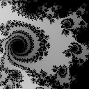

[Programação Paralela](https://github.com/AndreaInfUFSM/elc139-2019a) > Trabalhos

# T4: Geração de Fractais de Mandelbrot em OpenMP


## Introdução


Neste trabalho, você vai paralelizar um programa que gera uma sequência de imagens representando um "zoom" em um [fractal de Mandelbrot](https://en.wikipedia.org/wiki/Mandelbrot_set). A imagem ao lado foi gerada com esse programa.




## Preparação

1. Baixe o arquivo [fractal.zip](fractal.zip), que contém o programa sequencial de referência para este trabalho. Este programa foi desenvolvido pelo professor Martin Burtscher, da Texas State University (EUA).

2. Compile o programa:
   ```
   g++ fractal.cpp -o fractal
   ```

3. Execute o programa para imagens de diferentes tamanhos e diferentes quantidades de frames:
   ```
   ./fractal 512 32
   ./fractal 512 64
   ./fractal 1024 32
   ./fractal 1024 64
   ```

4. O programa só grava imagens em arquivo para imagens pequenas (<= 256) e poucos frames (<= 100). É recomendável gerar algumas imagens quando estiver testando seu programa paralelo, para verificar se estão sendo geradas corretamente. Caso você deseje gerar uma animação, pode-se usar por exemplo o seguinte comando do [ImageMagick](http://www.imagemagick.org):
   ```
   convert -delay 1x10 fractal1*.bmp fractal.gif
   ```


## Desenvolvimento


1. Observe como os parâmetros de entrada influenciam no tempo de execução do programa.

2. Analise o código e identifique oportunidades de paralelismo, considerando a arquitetura paralela alvo.

3. Projete **duas soluções** paralelas para o programa em questão e implemente 2 programa usando OpenMP: `fractalpar1.cpp` e `fractalpar2.cpp`. Você pode, por exemplo, variar as estratégias de particionamento, de escalonamento, etc.

4. Analise o desempenho dos programas paralelos, começando pela medição dos tempos de execução sequencial e paralela para diferentes entradas do programa: a) 1024 32, b) 1024 64 e c) à sua escolha. Varie o número de threads: 2, 4 e 8. Calcule speedup e eficiência para cada caso. Utilize a mesma técnica de medição de tempos para os dois programas. 


## Entrega

No seu repositório da disciplina, na pasta `trabalhos/t4`, crie um documento `Entrega.md`, contendo:
 - Identificação completa da disciplina e do aluno;
 - Links para os códigos desenvolvidos: `fractalpar1.cpp` e `fractalpar2.cpp` (**ATENÇÃO**: usar exatamente estes nomes, do contrário o trabalho **NÃO** será avaliado);
 - Link para **slides** explicando as estratégias de paralelização adotadas, descrevendo os experimentos realizados e discutindo os resultados obtidos. Os slides serão usados para apresentação do trabalho caso você seja sorteado para isso;
 - Referências.


## Material de apoio


- [Tutorial OpenMP](https://computing.llnl.gov/tutorials/openMP/)  
  Tutorial do Lawrence Livermore National Laboratory (LLNL) sobre OpenMP.
