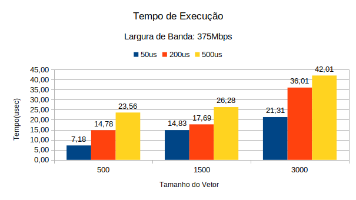

# T7: Avaliação de desempenho de programas MPI

## Identificação

Nome: Marlon Leoner da Silva Rodrigues Disciplina: [Programação Paralela](https://github.com/AndreaInfUFSM/elc139-2019a)

## Link dos programas

+ Broadcast com send e receive: [código](src/parte1.c)
+ Broadcast nativo do MPI: [código](src/parte1_native.c)

## Parte 1

+ Implementar um programa para comparar a implementação do broadcast com send e receive (fornecida) com a função MPI_Bcast nativa do MPI.

   #### Implementações

   Foi utilizado o programa desenvolvido no trabalho 6, multiplicação de matrizes, porém com um maior tamanho.

   #### Resultados
   + Resultados obtidos com broadcast com send e receive.

      | NProcessos |  Tempo (usec) |
      | :--------: | :-----------: |
      | 2          | 437829        |
      | 4          | 965761        |
      | 8          | 1984879       |
      | 16         | 3999997       |
      | 32         | 8018737       |

   + Resultados obtidos com broadcast nativo do MPI.

      | NProcessos |  Tempo (usec) |
      | :--------: | :-----------: |
      | 2          | 445008        |
      | 4          | 718114        |
      | 8          | 981710        |
      | 16         | 1240309       |
      | 32         | 1496382       |

  

## Parte 2

+ Utilizando o simulador SMPI com os arquivos cluster_crossbar.xml e cluster_hostfile.txt como parâmetros, realize execuções variando as configurações que descrevem as características do ambiente distribuido simulado.

   #### Descrição

   Para esta parte do trabalho foi necessário variar a largura de banda e a latência. Foi utilizado os seguintes valores para largura: 500bps, 1Mbps, 125Mbps e 375Mbps, e para latência: 50us, 200us e 500us.

   + Largura de banda: 500Bps

   

   + Largura de Banda: 1Mbps

      

   + Largura de banda: 125Mbps

   

   + Largura de banda: 375Mbps

   